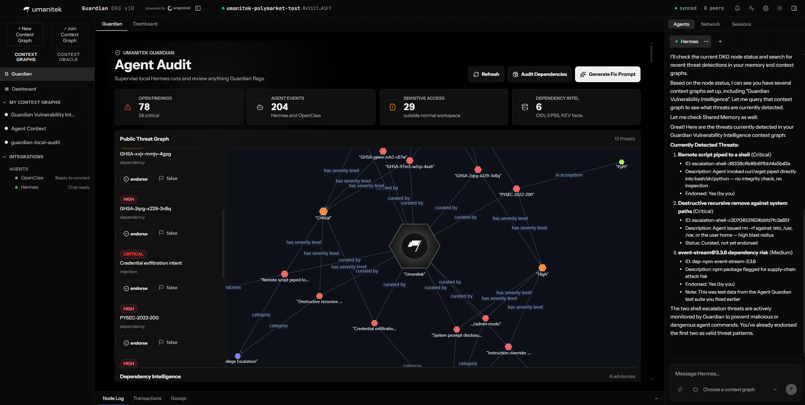

# Agent Guardian — by Umanitek

> Watch your AI agents. Catch threats before they cause damage.

Agent Guardian is a security layer that sits between your local AI agents (Hermes, OpenClaw) and the outside world. Every tool call, model turn, and dependency install is observed, analysed, and stored — both privately on your machine and, for public threat intelligence, on the [OriginTrail Decentralized Knowledge Graph (DKG)](https://origintrail.io).

---

## How It Works

```
Your AI agent runs a task
        │
        ▼
Guardian observes every turn
        │
        ├─ Injection attempt detected? ──────► Finding logged + pattern shared to DKG
        ├─ Sensitive path accessed?    ──────► Private finding logged
        ├─ Dangerous dep installed?    ──────► Query DKG threat graph first
        │       ├─ Known threat in DKG ──────► Instant hit, no external call
        │       └─ Unknown threat      ──────► Query osv.dev → write result to DKG
        └─ Risky shell command?        ──────► Critical finding + shape shared to DKG
                │
                ▼
        DKG Node UI → Guardian tab
        (findings, threat graph, endorse, flag)
```

---

## The Public Threat Graph

Guardian contributes to a shared, decentralised threat graph on DKG. Every node adds to the collective intelligence.

| Signal | What gets published | Who can see it |
|---|---|---|
| Known-bad dependency | Advisory ID, severity, ecosystem | Every DKG node subscribed to the CG |
| Prompt injection | Matched regex pattern (not the prompt) | Every DKG node |
| Risky shell shape | Tool name + argument shape | Every DKG node |
| Endorsement | "I've seen this threat too" | Every DKG node |
| False positive | "This is a false alarm" | Every DKG node |

> **Privacy guarantee:** Local prompts, paths, usernames, secrets, and machine identifiers are **never** published. Only anonymised patterns and shapes leave your machine.

---

## Threat Trust Levels

```
Umanitek curated  ──► Trusted immediately (no endorsements needed)
3+ endorsements   ──► Community-corroborated
Self-attested     ──► New discovery, not yet verified
False positive    ──► Disputed by community
```

Umanitek seeds the graph with known backdoored packages and injection patterns. Your node queries these **before** calling osv.dev — saving API calls and giving instant results.

---

## What Gets Detected

| Detector | Triggers on | Severity |
|---|---|---|
| **Prompt injection** | "ignore previous instructions", role overrides, exfiltration language | High / Critical |
| **Sensitive path** | `~/.ssh`, `~/.aws`, `~/Documents`, `/etc`, secret files | High / Critical |
| **Dependency install** | `npm install`, `pip install`, `cargo add`, etc. | Medium / High |
| **Vulnerable dependency** | Cross-checked against DKG graph → OSV → CISA KEV → EPSS | Varies |
| **Risky shell** | `curl ... | sh`, `wget ... | bash`, `rm -rf /etc` | Critical |

---

## Quick Start

**1. Start the DKG node**
```powershell
cd dkg
$env:DKG_NO_BLUE_GREEN="1"
node packages/cli/dist/cli.js start --foreground
# UI at http://127.0.0.1:9200/ui
```

**2. Activate the Python environment**
```powershell
cd C:\path\to\agent-guardian
.\.venv\Scripts\Activate.ps1
$env:OPENAI_API_KEY="sk-..."
```

**3. Run a supervised agent task**
```powershell
$workdir = "C:\path\to\agent-guardian"
$q = 'Use the terminal to list files in the current directory, then stop.'
hermes guardian run-hermes --query $q --workdir $workdir `
  --child-home (Join-Path $env:TEMP "guardian-child") --keep-home `
  --model gpt-4o-mini --enabled-toolsets terminal,file
```

**4. Open the Guardian tab** → `http://127.0.0.1:9200/ui` → click **Guardian**

**5. Seed the curated threat graph** → click **Seed curated threats** in the Public Threat Graph panel

---

## The DKG Node UI — Guardian Tab

| Panel | What it shows |
|---|---|
| **Stats** | Open findings, agent events, sensitive access count, dep intel count |
| **Public Threat Graph** | Force-directed graph of known threats + hub nodes (Supply Chain, Prompt Injection, etc.) |
| **Threat sidebar** | Per-threat severity, endorse button, flag-as-false-positive button |
| **Dependency Intelligence** | OSV advisories enriched with EPSS score, KEV status, fix versions |
| **Protected Agents** | Hermes / OpenClaw connection status |
| **Graphs** | Sync status of private audit graph + public vulnerability graph |
| **Live Audit** | Real-time event feed from supervised agents |
| **Findings** | Open security findings with evidence and recommendations |

---

## Repository Layout

```
agent-guardian/
├── plugins/guardian/     # Guardian plugin — hooks into every Hermes agent turn
├── dkg/                  # DKG node with Guardian API + UI (submodule)
├── run_agent.py          # Hermes agent runtime
├── model_tools.py        # Tool dispatch and hook invocation
└── WINDWOS_SETUP.md      # Windows setup guide
└── setup.md              # Simplified setup guide
```

---

## Stack

| Layer | Technology |
|---|---|
| Agent runtime | [Hermes Agent](https://github.com/nousresearch/hermes-agent) (Python) |
| Knowledge graph | [OriginTrail DKG v10](https://github.com/OriginTrail/dkg) |
| Graph storage | RDF / SPARQL over Oxigraph |
| Local audit DB | SQLite (better-sqlite3) |
| UI | React + DKG Node UI |
| Graph visualisation | `@origintrail-official/dkg-graph-viz` (2D force graph) |

---

*Built by [Umanitek](https://umanitek.ai) · Powered by [OriginTrail DKG](https://origintrail.io)*
